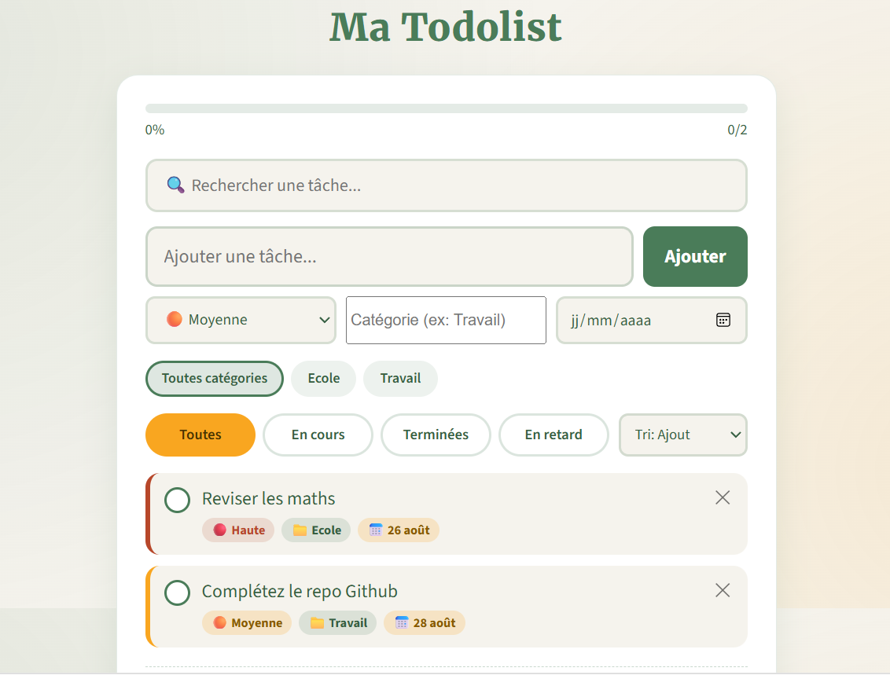

# 🌿 Ma Todolist — Botanical Garden

Une todolist simple, intelligente et responsive, construite en **HTML / CSS / JavaScript pur** (un seul fichier, aucune dépendance backend). Disponible en application web et packagée en APK Android via WebView.

---

## ✨ Fonctionnalités

- ✅ Ajout, suppression et complétion de tâches
- 🎯 Priorités (Faible / Moyenne / Haute) avec code couleur
- 📁 Catégories personnalisées avec filtrage par chips
- 📅 Échéances avec détection automatique des tâches en retard
- 🔍 Recherche en temps réel
- ↕️ Tri (ajout, priorité, échéance, alphabétique)
- 📊 Barre de progression
- 💾 Sauvegarde automatique via `localStorage` (les données persistent au redémarrage)
- 📱 Interface responsive, optimisée mobile (safe areas, tap targets adaptés)
- 🎨 Thème "Botanical Garden" (vert fougère, marigold, terracotta)

---

## 📸 Aperçu

<!--
  Ajoute tes deux captures d'écran dans un dossier `screenshots/` à la racine du repo,
  puis remplace les noms de fichiers ci-dessous si besoin.
-->

| Avant l'ajout d'une tâche | Après l'ajout d'une tâche |
|:---:|:---:|
|  |  |

---

## 🚀 Démo en ligne

🔗 [Ouvrir l'application](#) <!-- Remplace # par ton URL Vercel/GitHub Pages une fois déployée -->

---

## 🗂️ Structure du projet

```
.
├── index.html          # Application complète (HTML + CSS + JS)
├── screenshots/
│   ├── avant-ajout.png
│   └── apres-ajout.png
└── README.md
```

---

## 🛠️ Installation locale

Aucune dépendance, aucune compilation nécessaire.

```bash
git clone https://github.com/<ton-pseudo>/<nom-du-repo>.git
cd <nom-du-repo>
```

Ouvre simplement `index.html` dans un navigateur, ou lance un petit serveur local :

```bash
# avec Python
python3 -m http.server 8000

# avec Node.js
npx serve
```

Puis rends-toi sur `http://localhost:8000`.

---

## ☁️ Déploiement gratuit

### Vercel (recommandé)

**Avec la CLI, sans GitHub :**
```bash
npm i -g vercel
vercel
```

**Avec GitHub connecté (déploiement auto à chaque push) :**
1. Pousse ce repo sur GitHub
2. Sur [vercel.com](https://vercel.com) → *Add New Project* → *Import Git Repository*
3. Sélectionne le repo → *Deploy*

### GitHub Pages (alternative)

1. Renomme le fichier principal en `index.html` (déjà fait)
2. Repo → *Settings* → *Pages* → Source: branche `main`, dossier `/root`
3. URL générée : `https://<ton-pseudo>.github.io/<nom-du-repo>/`

---

## 📱 Version APK (Android)

L'application est packagée via **Capacitor**, avec une WebView qui charge l'URL hébergée (voir section Déploiement). Cela permet de mettre à jour l'app pour tous les utilisateurs simplement en poussant une modification sur le dépôt — sans recompiler ni redistribuer un nouvel APK.

### Mettre à jour l'app
```bash
git add .
git commit -m "Description de la mise à jour"
git push
```
→ Vercel redéploie automatiquement, l'APK affiche la nouvelle version au prochain lancement.

### Rebuild de l'APK (uniquement si le contenu est embarqué en local, pas en WebView distante)
```bash
npx cap sync
```
Puis ouvrir le dossier `android/` dans Android Studio → *Build* → *Generate Signed Bundle / APK* (utiliser le même keystore que la version précédente, et incrémenter `versionCode` dans `build.gradle`).

---

## 💾 Stockage des données

Les tâches sont sauvegardées localement dans le `localStorage` du navigateur/WebView, sous la clé `botanical_todolist_v1`. Aucune donnée n'est envoyée à un serveur externe.

---

## 🎨 Thème

| Couleur | Code | Usage |
|---|---|---|
| Fern Green | `#4a7c59` | Couleur principale |
| Marigold | `#f9a620` | Accents, priorité moyenne |
| Terracotta | `#b7472a` | Alertes, priorité haute |
| Cream | `#f5f3ed` | Fond |

Polices : *Merriweather* (titres), *Source Sans 3* (texte).

---

## 📄 Licence

Projet personnel — libre d'utilisation et de modification.
